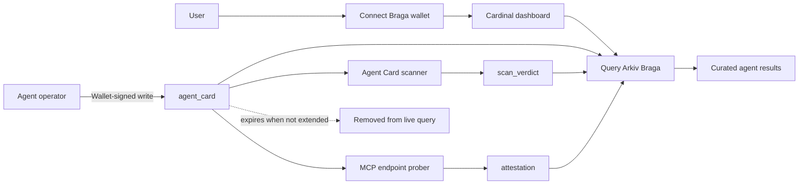
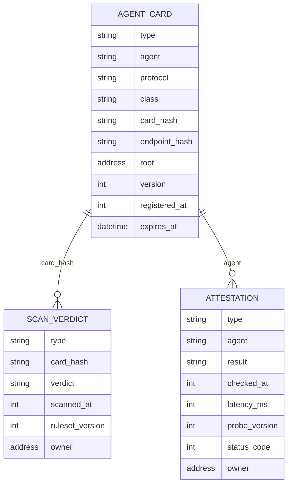

# Cardinal Architecture Sketch

This diagram shows the current Cardinal product flow and the Arkiv records used to build a curated MCP registry result.

## System flow



## Entity relationship



## Curated result rule

```text
unexpired agent_card
+ passing scan_verdict for the same card_hash
+ recent passing attestation for the same agent
= Cardinal registry result
```

## Record ownership

- The operator wallet publishes the Agent Card.
- An approved scanner wallet publishes the scan verdict.
- An approved prober wallet publishes the liveness attestation.
- Cardinal joins the records through typed attributes and timestamps.

The current web prototype writes Agent Cards and performs scanning and probing. Independent onchain scanner and prober writers, trust-anchor owner validation, endpoint ownership proofs, and heartbeat extension are planned service layers.

## What stays outside Arkiv

Private keys, API keys, authorization headers, raw sensitive scanner inputs, MCP execution traffic, large logs, screenshots, and temporary transport events stay outside Arkiv. Arkiv stores compact, queryable registry state and evidence metadata.
